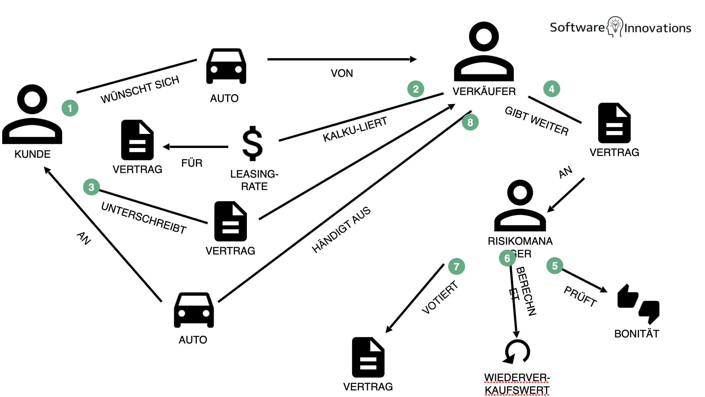

# Claim 1: DDD is inherently object oriented.

DDD is about modelling business concepts, creating ubiquitous language, defining bounded contexts.

## What is DDD 
### Core Concepts

**Ubiquitous Language**

**Bounded Contexts**

**Domain Model**

### Building Blocks

**Entities**

**Value Objects**

**Aggregates**

**Repositories**

**Domain Services**

**Domain Events**

### Strategic Design

- Focus on the most valuable/complex parts (Core Domain)
- Integration patterns between bounded contexts
- Context mapping to visualize relationships


## Does DDD work if implemented functionally

The Domain should be modelled based on a common understanding of Language. Intuitively, you might think that only works using Objects, since that is how we commonly model the World. 

Example:

```typescript
class Customer {
  constructor(private readonly id: string, private name: string) {}

  createOrder(items: OrderItem[]): Order {
    return new Order(this.id, items);
  }
}

class Order {
  constructor(
    public readonly customerId: string,
    private items: OrderItem[]
  ) {}
}

class OrderItem {
  constructor(private productId: string, private quantity: number) {}
}
```

The ubiquitous language "Customer creates Order" maps directly to customer.createOrder(). That is consistent with this interpretation of the world.



But, we can just as easily model the world as a set of processes of cause and effect (data transformations).


## How functional DDD might look

**Ubiquitous Language**
**Bounded Contexts**
**Domain Model**
**Entities**
**Value Objects**
**Aggregates**
**Repositories**
**Domain Services**
**Domain Events**

```typescript

```

```typescript

```

```typescript

```

```typescript

```