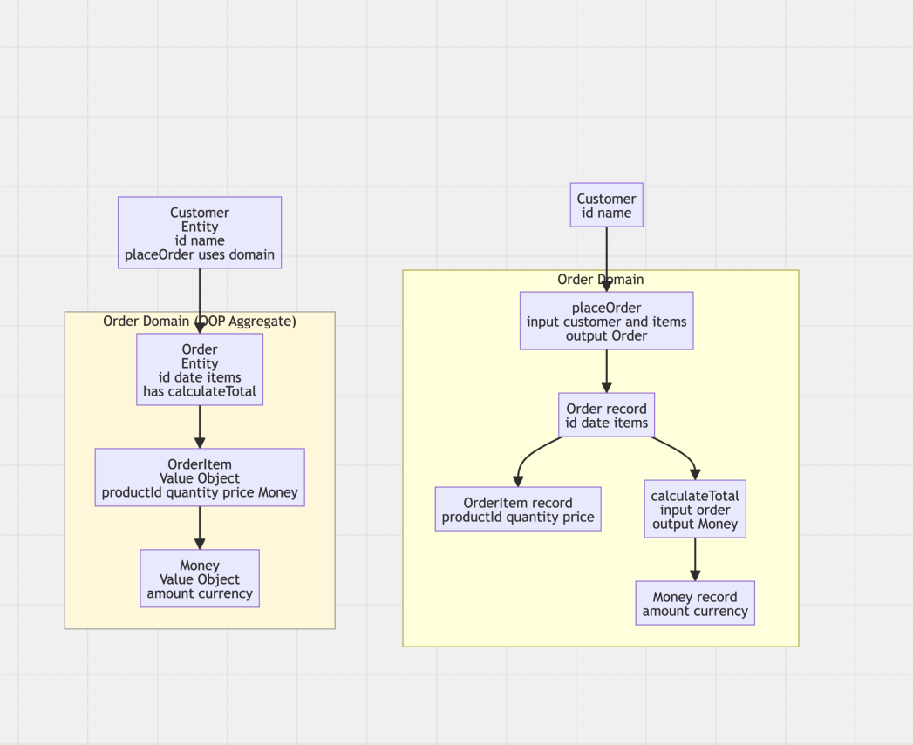

# Claim 1: DDD is inherently object oriented.

DDD is about modelling business concepts, creating ubiquitous language, defining bounded contexts.

## What is DDD 
### Core Concepts

**Ubiquitous Language**

**Bounded Contexts**

**Domain Model**

### Building Blocks

**Entities**

**Value Objects**

**Aggregates**

**Repositories**

**Domain Services**

**Domain Events**

### Strategic Design

- Focus on the most valuable/complex parts (Core Domain)
- Integration patterns between bounded contexts
- Context mapping to visualize relationships


## Does DDD work if implemented functionally

The Domain should be modelled based on a common understanding of Language. Intuitively, you might think that only works using Objects, since that is how we commonly model the World. 

Example:

```typescript
class Customer {
  constructor(private readonly id: string, private name: string) {}

  createOrder(items: OrderItem[]): Order {
    return new Order(this.id, items);
  }
}

class Order {
  constructor(
    public readonly customerId: string,
    private items: OrderItem[]
  ) {}
}

class OrderItem {
  constructor(private productId: string, private quantity: number) {}
}
```

The ubiquitous language "Customer creates Order" maps directly to customer.createOrder(). That is consistent with this interpretation of the world.


But, we can just as easily model the world as a set of processes of cause and effect (data transformations).




## How functional DDD might look

**Ubiquitous Language**
In OOP: class names, method names, property names in ubiquitous language

In FP: instead of naming classes, name types and functions
Instead of Order.approve(), you might have a function approveOrder : Order -> Order.

**Bounded Contexts**
In OOP: Mapped to module, package, namespace containing related classes.

In FP: Mapped to module, or namespace related to types and functions.
There is no shared mutable state accross boundaries, since functional code has explicit dependencies and pure composition.

**Domain Model**
In OOP: hierarchies where behavior and state is coupled


In FP: 
a set of pure types and functions that model the real world.

**Entities**
In OOP:
Entities are objects with identity and mutable state.

In FP: 
Entities are immutable data structures that contain their identity and any state at a point in time.

**Value Objects**
In OOP:
Often small, immutable classes with value equality.

In FP: simple types, equality is derived automatically. One step further is pattern matching in functional languages (like elixir).

**Repositories**
In OOP: classes that hide persistence mechanics behind oop interfaces.

In FP: functions that represent persistence behavior that can be injected as dependencies.

**Aggregates**
In OOP:
Objects that encapsulate entities to enforce correct mutation

In FP:
Aggregates are functions that take current state + command → new state (+ events). That's all thats needed to enforce invariants, since there's no mutation.

**Domain Services**
In OOP:
Classes encapsulating domain logic that doesn’t belong to a single entity.


In FP:
Pure functions grouped in a module
If side effects are needed, they’re made explicit by returning them as data (e.g., commands or events), so they don't do those directly.

**Domain Events**
In OOP:
Events raised by entities or aggregates that something meaningful happened

In FP:
Immutable Data Records